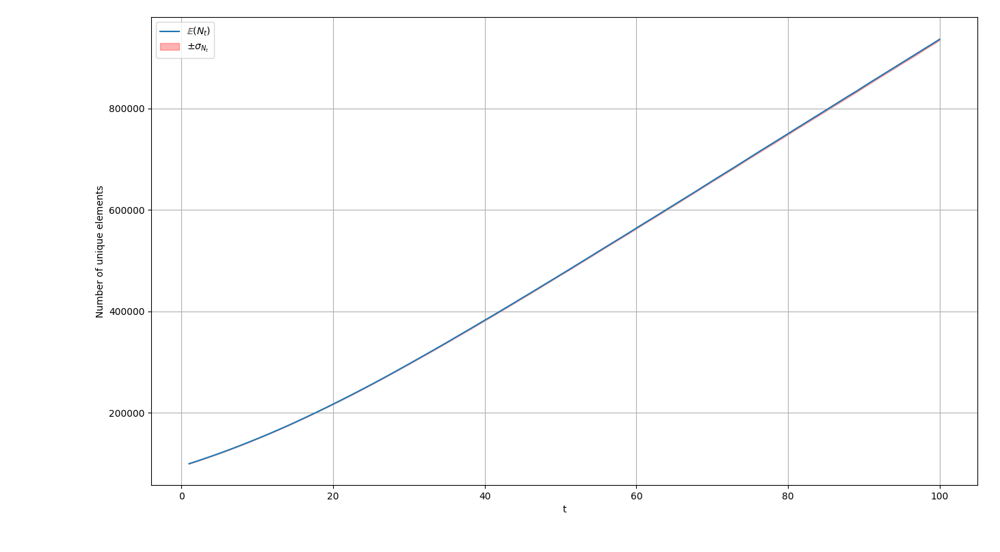
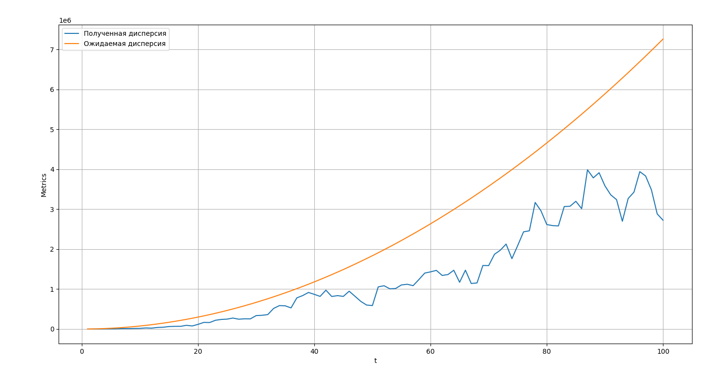
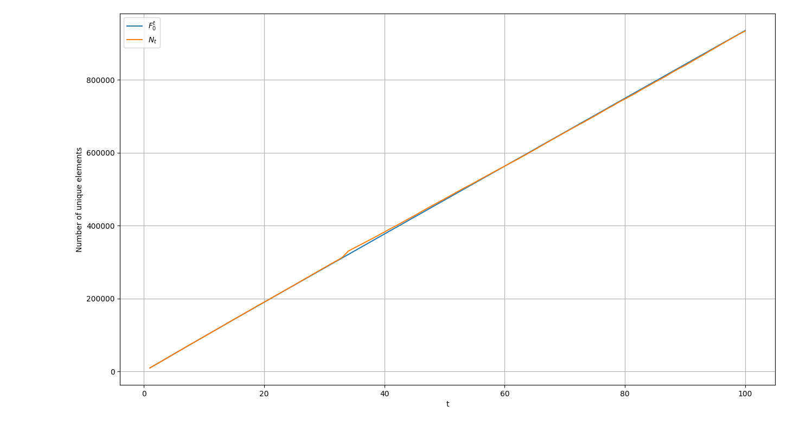

### Быков Дмитрий БПИ244

[https://github.com/Dentander/HSE-ALGORITHMS-SET5-A3](https://github.com/Dentander/HSE-ALGORITHMS-SET5-A3)

# A3. HyperMegaLogLog Pro Max++

## Детали реализации

- В кажестве хеша используется `std::hash` с случайно сгенерированной солью

- Перебрав различное количество бит (файл `bits_finder.cpp`), выделяемое для нахождения субпотока, получилось, что оптимально брать значения от `13` до `18`. В финальной версии было выбрано `17`, так как при нем были лучшие результаты.

## Графики


**График №1 — сравнение оценки и истинного значения**  
 - **Ось X:** шаг времени  t  (или объём обработанной части потока).  
 - **Ось Y:** количество уникальных элементов.  
 - **Линии:**  
   1. Истинное количество уникальных элементов  F_0^t  (например, точный счётчик).  
   2. Оценка  N_t , полученная алгоритмом.



**График №2 — статистика оценки**  
- **Ось X:** шаг времени  t.  
- **Ось Y:** значение оценки.  
- **Элементы:**  
  1. Линия математического ожидания оценки  E(N_t)  (среднее по запускам).  
  2. Закрашенная область между  E(N_t) + sigma_{N_t}  и  E(N_t) - sigma_{N_t}  (стандартное отклонение).



Сравнение дисперсий

## Анализ

Статистика по тестам:

```python
m = 131072
1.042/sqrt(m) = 0.00287815
1.32 /sqrt(m) = 0.00364602
Violations (1.042): 62
Violations (1.32 ): 54
```

Число превышений:

* ( > 0.00288 ): **62**
* ( > 0.00365 ): **54**

Доля превышений мала относительно общего числа измерений (1 миллион) => Можно сделать вывод, что укладывается в рамки теоретических отклонений в

* ( > 0.00288 ): `(1_000_000 - 62) / 1_000_000 = 0.999938` 
* ( > 0.00365 ): `(1_000_000 - 54) / 1_000_000 = 0.999946`

---

Теоретическая дисперсия:

`(N * 1.04 / sqrt(m))^2` = `(0.00288 * N)^2`

По графику дисперсий видно, что настоящая дисперсия меньше теоретической, что означает стабильность дисперсии.

На графике 2 дисперсии почти не видно, что хорошо.

---


Перебрав различное количество бит (файл `bits_finder.cpp`), выделяемое для нахождения субпотока, получилось, что оптимально брать значения от `13` до `18`. В финальной версии было выбрано `17`, так как при нем были лучшие результаты. `Metrics` - аналог `MSE`

```java
Bits: 1 Metrics: 3.33718e+11
Bits: 2 Metrics: 1.9667e+11
Bits: 3 Metrics: 1.00097e+11
Bits: 4 Metrics: 9.20919e+10
Bits: 5 Metrics: 3.23845e+10
Bits: 6 Metrics: 6.87814e+09
Bits: 7 Metrics: 9.26609e+08
Bits: 8 Metrics: 1.75231e+09
Bits: 9 Metrics: 1.66328e+09
Bits: 10 Metrics: 1.81258e+09
Bits: 11 Metrics: 3.05969e+08
Bits: 12 Metrics: 2.32387e+08
Bits: 13 Metrics: 7.061e+07
Bits: 14 Metrics: 6.93697e+07
Bits: 15 Metrics: 9.56498e+07
Bits: 16 Metrics: 3.37679e+07
Bits: 17 Metrics: 1.9378e+06
Bits: 18 Metrics: 5.84317e+06
Bits: 19 Metrics: 5.46982e+09
Bits: 20 Metrics: 1.33953e+11
Best bits: 17
```

## Улучшения

При малых значениях `HyperLogLog` дает не самый лучший результат. Я добавил коррекцию при малых значениях:

```c
if (estimate <= 2.5 * registers_.siz() && emptyRegs > 0) {
    estimate = registers_.size() * log(static_cast<double>(registers_.size()) / emptyRegs);
}
```

[https://habr.com/ru/companies/vk/articles/711126/](https://habr.com/ru/companies/vk/articles/711126/)

Полученные графики:




Можно заметить, что теперь при малых значениях `HyperLogLog` дает значительно лучше результат.